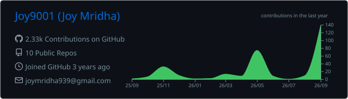
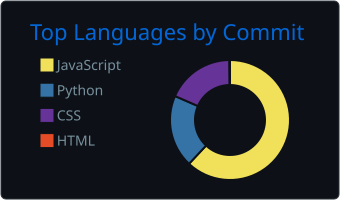
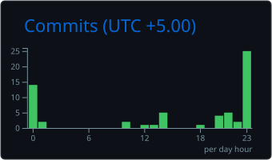
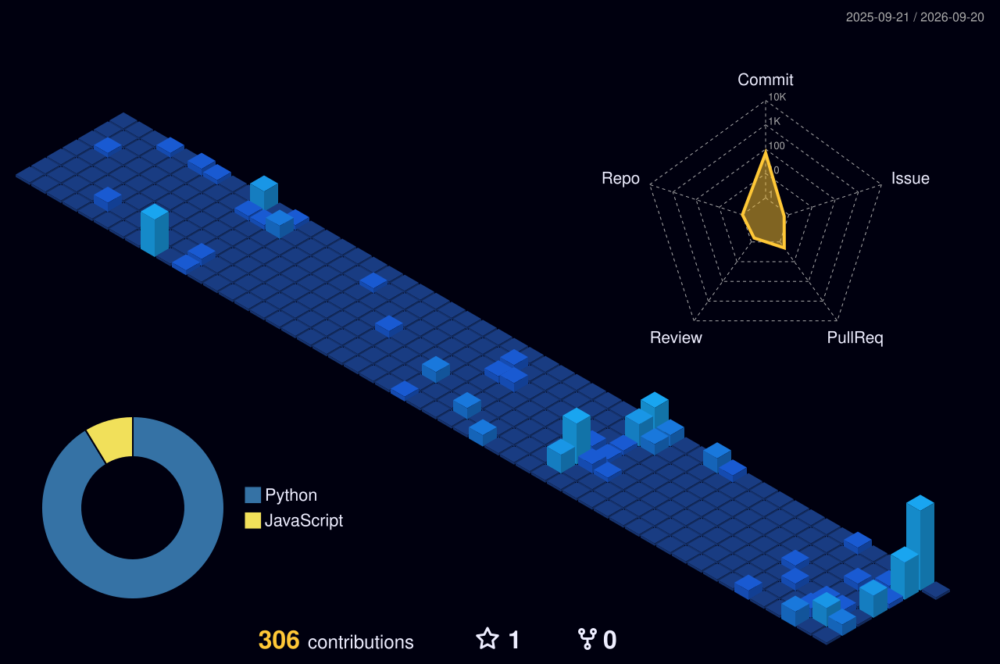
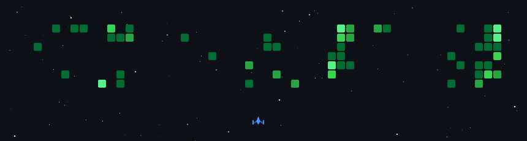

<div align="center">


<br><br>

<a href="https://linkedin.com/in/joy1010"></a>
<a href="https://x.com/JoyMridha1010"></a>
<a href="mailto:joymridha939@gmail.com"></a>


</div>

```go
me := Joy{
    Location:  "Kolkata, India 🇮🇳",
    Writes:    []string{"Go", "Python", "TypeScript"},
    Obsession: "agents that do the boring parts",
    Editor:    "Zed, and VS Code when I'm weak",
}
```

<div align="center">


<br><br>






<br><br>



### 👾 my commits, as a space shooter



<sub>regenerates itself daily — <a href="./.github/workflows/profile.yml">the workflow</a></sub>


</div>
