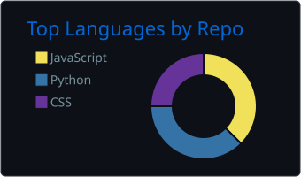
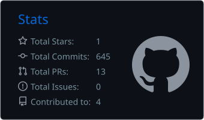
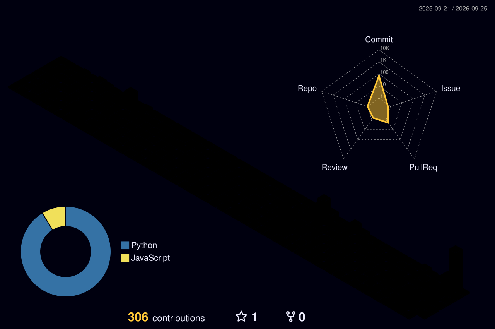

<div align="center">


<a href="https://github.com/Joy9001">
  
</a>

<br><br>

<a href="https://linkedin.com/in/joy1010"></a>
<a href="https://x.com/JoyMridha1010"></a>
<a href="mailto:joymridha939@gmail.com"></a>


</div>

<br>

```go
package main

type Joy struct {
    Location  string
    Writes    []string
    Obsession string
    Editor    string
}

func main() {
    me := Joy{
        Location:  "Kolkata, India 🇮🇳",
        Writes:    []string{"Go", "Python", "TypeScript"},
        Obsession: "agents that do the boring parts",
        Editor:    "Zed, and VS Code when I'm weak",
    }
    me.BuildSomething() // ← currently running
}
```

<br>

<div align="center">

### 🧰 things I reach for


</div>

---

<div align="center">

### 📊 the numbers








</div>

---

<div align="center">

### 🐍 watch a snake eat my commits

<picture>
  <source media="(prefers-color-scheme: dark)" srcset="./assets/snake-dark.svg">
  <source media="(prefers-color-scheme: light)" srcset="./assets/snake-light.svg">
  
</picture>

</div>

---

<div align="center">

### 🧊 my year, in three dimensions



</div>

---

<div align="center">

### 👾 and the same commits, as a space shooter


<sub>every one of these regenerates itself daily — the workflow is <a href="./.github/workflows/profile.yml">right here</a>, no external services to rot</sub>

</div>

---

<div align="center">


<br><br>


</div>
