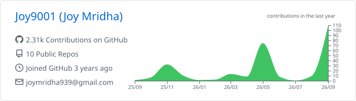
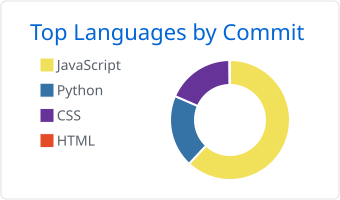
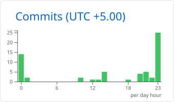
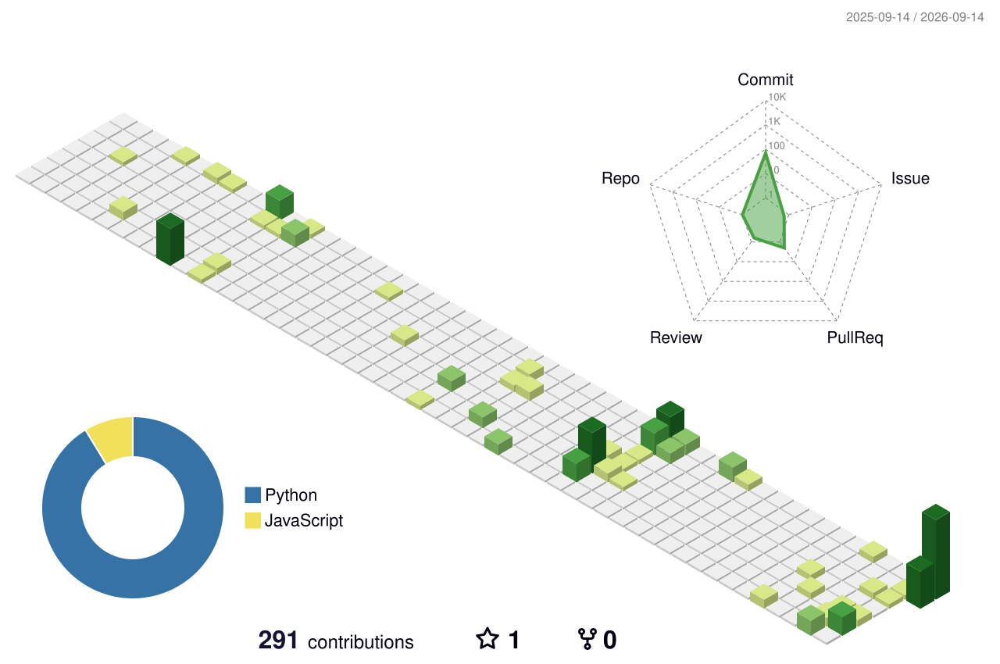

<div align="center">

<picture>
  <source media="(prefers-color-scheme: dark)" srcset="./assets/header-dark.svg?v=2">
  <source media="(prefers-color-scheme: light)" srcset="./assets/header-light.svg?v=2">
  
</picture>

<br>

<a href="https://linkedin.com/in/joy1010"></a>
<a href="https://x.com/JoyMridha1010"></a>
<a href="mailto:joymridha939@gmail.com"></a>


</div>

```go
me := Joy{
    Location:  "Kolkata, India 🇮🇳",
    Writes:    []string{"Go", "Python", "TypeScript"},
    Obsession: "agents that do the boring parts",
    Editor:    "Zed, and VS Code when I'm weak",
}
```

<div align="center">


<br>

<picture>
  <source media="(prefers-color-scheme: dark)" srcset="./profile-summary-card-output/github_dark/0-profile-details.svg">
  
</picture>

<picture>
  <source media="(prefers-color-scheme: dark)" srcset="./profile-summary-card-output/github_dark/2-most-commit-language.svg">
  
</picture>
<picture>
  <source media="(prefers-color-scheme: dark)" srcset="./profile-summary-card-output/github_dark/4-productive-time.svg">
  
</picture>

<br>

<picture>
  <source media="(prefers-color-scheme: dark)" srcset="./profile-3d-contrib/profile-night-view.svg">
  
</picture>

<br>

### 👾 my commits, as a space shooter


</div>
