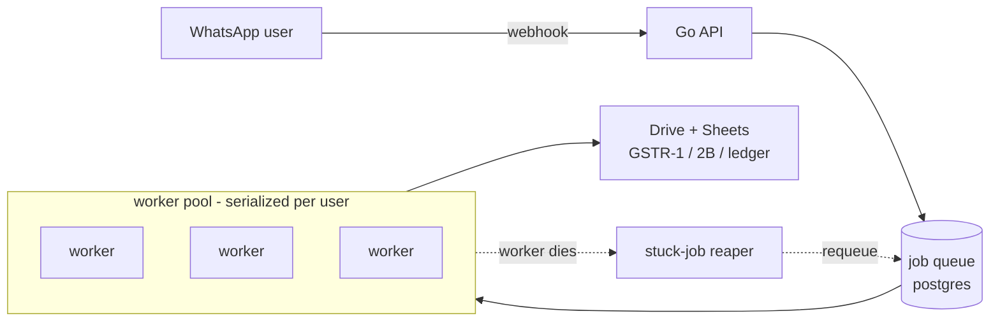
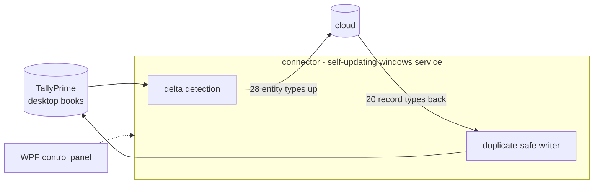
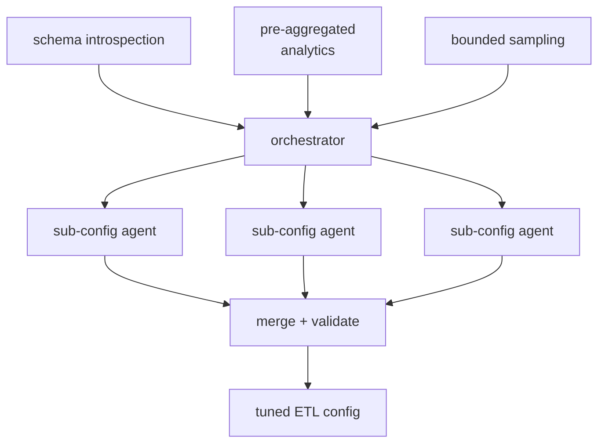

<picture>
  <source media="(prefers-color-scheme: dark)" srcset="assets/header-dark.svg">
  <source media="(prefers-color-scheme: light)" srcset="assets/header-light.svg">
  
</picture>

I build backend systems that have to stay correct when things fail — job queues,
two-way syncs, agent pipelines. Most of my last year was **Go and PostgreSQL** in
production, and the year before that was **agentic AI** back when LangGraph was
the new thing. I like the problems where the interesting part isn't the happy path.

Recently: **Software Engineer at WFYI** (intern → full-time, Oct 2025 – Aug 2026).
Before that **Couture.ai** and **Qbtrix Innovations**.
**B.Tech CSE, IIIT Sri City** — 9.17 CGPA, graduated July 2026.

---

## Systems I've built

Three that were genuinely hard. Expand for the architecture and the part that
actually took the thinking.

<b>WhatsApp accounting assistant</b> — Go · PostgreSQL · Drive & Sheets API

 

A conversational bookkeeper. Small businesses forward an invoice to WhatsApp; it
lands in their own Google Drive and Sheets as GSTR-1, GSTR-2B and ledger rows.

**The hard part.** There's no broker — correctness comes out of Postgres alone.
Delivery is at-least-once, so every handler had to be safe to run twice. Two jobs
for the same user must never touch their books concurrently, so serialization is
enforced per-user *at the database level* rather than hoped for in application
code. And a worker that dies mid-job leaves a row claimed forever, so a reaper
sweeps and requeues it.

The failure modes here aren't theoretical: a duplicate write means a business
files the wrong numbers with the tax authority.

<b>TallyPrime ↔ cloud connector</b> — C# / .NET · Windows service · WPF

 

Two-way sync between a customer's desktop TallyPrime books and the cloud —
**28 entity types up, 20 record types back**.

**The hard part.** Tally gives you neither change tracking nor write idempotency.
No "what changed since" query, no way to say "apply this once." So the connector
brings both itself: its own delta detection to avoid re-syncing everything, and
duplicate-safe writes so a retry can't double-post an entry.

It also ships to machines nobody can SSH into — hence a self-updating Windows
service with a control panel a non-technical user can actually operate.

<b>Multi-agent ETL parameter tuner</b> — Python · LangGraph · Ollama

 

Analysts were hand-tuning ETL configs in SQL against **500–600 GB** retail
datasets. This replaced that with a multi-agent system.

**The hard part.** You cannot put 600 GB in front of an LLM. The whole design is
about giving agents a faithful picture of data they can't see — schema
introspection for structure, pre-aggregated analytics for distribution, bounded
sampling for the rest. Sub-configs explore in parallel and merge.

**Result:** configs within **5% of expert-chosen values**, turnaround from hours
down to **~5 minutes** per product vertical.

<b>Also</b> — agent workflows, an LLM gateway, a Redis bridge

 

- **Interacly agent workflows** (LangGraph) — an orchestrator fans tasks to parallel
  workers and can *pause mid-run to ask the user a question*, with RAG over Notion,
  Drive, Discord and YouTube. Human-in-the-loop is easy to describe and unpleasant
  to actually implement in a graph.
- **Multi-provider LLM gateway** (FastAPI) — fronts OpenAI and Anthropic with
  per-request token accounting and billing.
- **NestJS ↔ Python over Redis** — moved document-processing status updates from
  Pub/Sub to Streams, and made each document release its lock on *failure* as well
  as completion. Pub/Sub drops messages when nobody's listening; Streams don't.
- **Resumable Gemini batch pipeline** — Python, behind 1,000+ published articles.

---

## Public work

| | | |
|---|---|---|
| **[StreamX](https://github.com/Joy9001/StreamX)** | Role-based video platform — editors upload drafts, owners approve and publish straight to YouTube. Auth0 + JWT, per-role storage quotas, ownership transfers. | `React` `Node` `MongoDB` |
| **[dsa-agent](https://github.com/Joy9001/dsa-agent)** | Agent that writes LeetCode notes for me. | `Python` |
| **[Chat-Verse](https://github.com/Joy9001/Chat-Verse)** | Real-time chat. | `React` `Socket.io` |

Most of what I build now is private or at work, so this profile is the smaller half
of the picture.

---

## Stack

**Daily** — Go (Gin) · Python (FastAPI) · Node (Express, NestJS) · PostgreSQL · Redis · TypeScript

**Agentic AI** — LangGraph · LangChain · RAG pipelines · multi-agent orchestration · OpenAI / Anthropic / Gemini · Ollama

**Also shipped with** — C# / .NET · Next.js · React · MongoDB · Prisma · Docker · AWS S3 · GitHub Actions

Frontend I'm comfortable in — I shipped the Next.js app for our tax platform end to
end — but backend is where I'd rather be.

---

## Reach me

[**Email**](mailto:joymridha939@gmail.com) · [**LinkedIn**](https://linkedin.com/in/joy1010) · [**X**](https://x.com/JoyMridha1010)

Open to backend and GenAI/agentic engineering roles.

